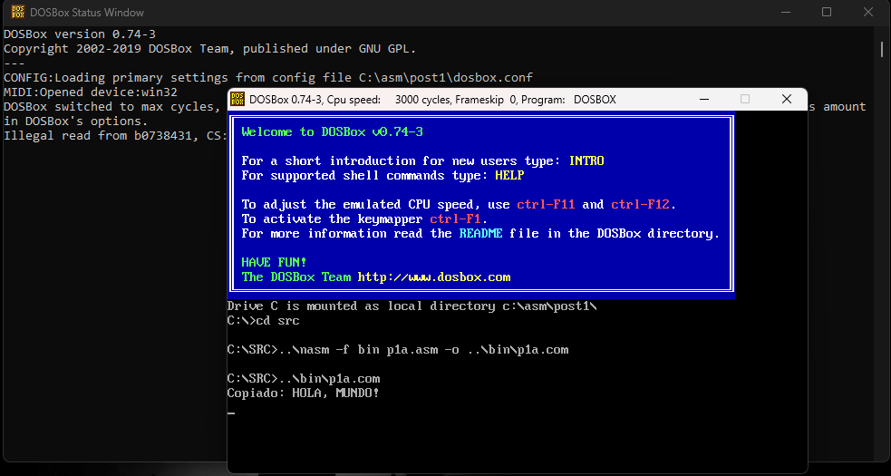
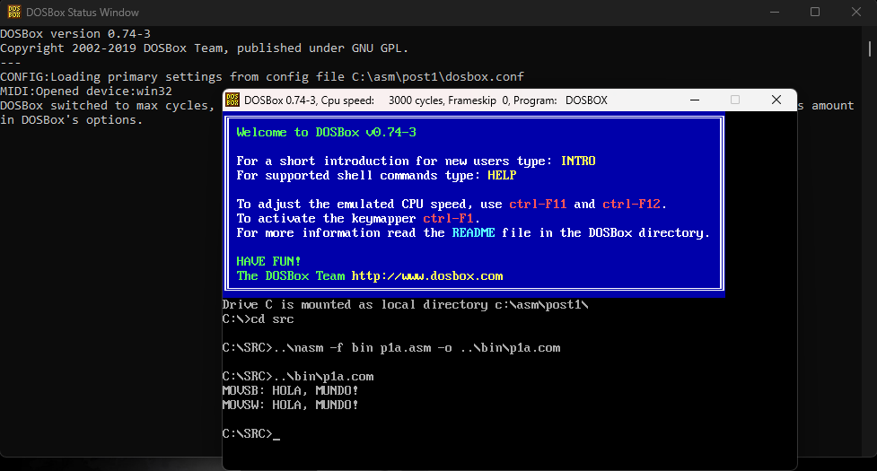
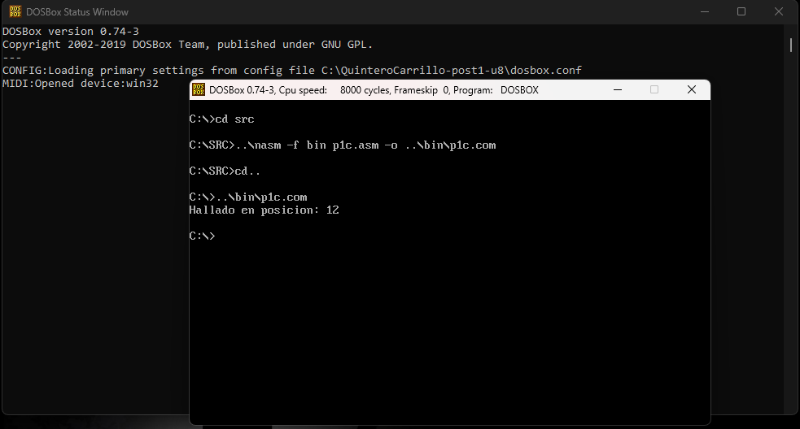
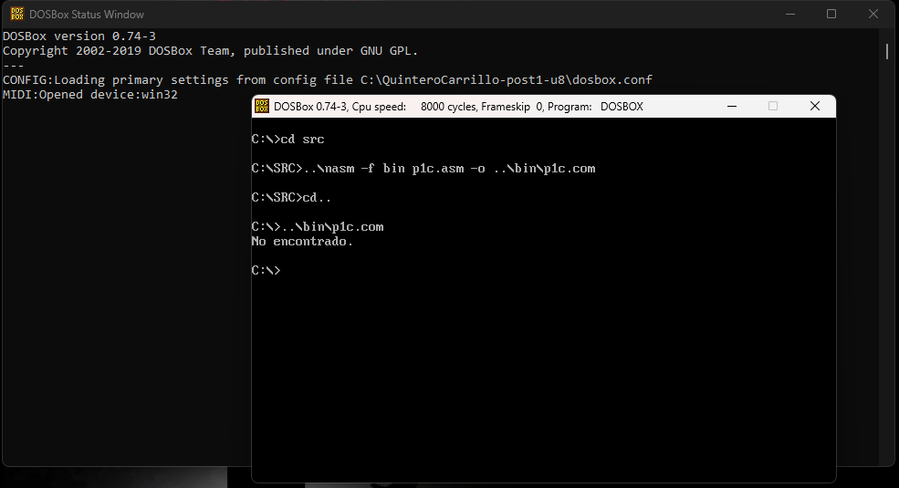
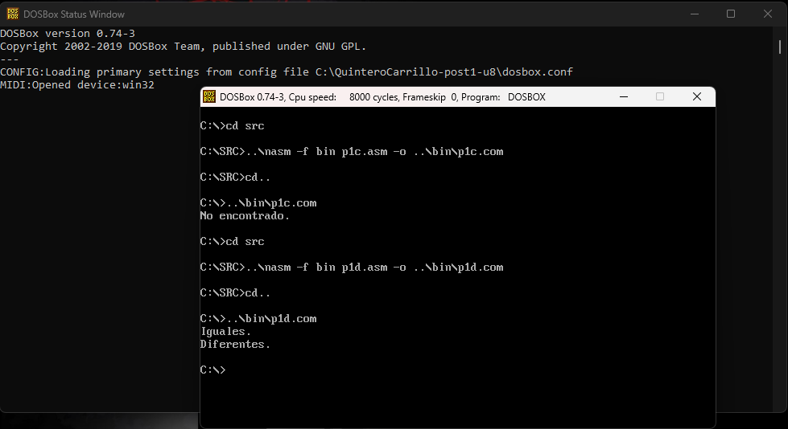

# Laboratorio Post-Contenido 1 — Operaciones con Cadenas
**Arquitectura de Computadores — Unidad 8**  
**Universidad Francisco de Paula Santander**  
**Ingeniería de Sistemas — 2026**  
**Estudiante:** Neidys Mariana Quintero Carrillo

---

## Descripción General

Este laboratorio implementa en NASM bajo DOSBox las instrucciones de
procesamiento de cadenas del procesador x86 en modo real (16 bits):
`REP MOVSB`, `REP MOVSW`, `REPNE SCASB` y `REPE CMPSB`. Cada programa
se compila como archivo `.com` con `ORG 100h` y se ejecuta directamente
en DOSBox 0.74-3.

---

## Estructura del Repositorio
```
QuinteroCarrillo-post1-u8/
├── src/
│   ├── p1a.asm   → Checkpoint 1: REP MOVSB (copia 13 bytes)
│   ├── p1b.asm   → Checkpoint 2: REP MOVSW + MOVSB (copia optimizada)
│   ├── p1c.asm   → Checkpoint 3: REPNE SCASB (búsqueda de carácter)
│   └── p1d.asm   → Checkpoint 4: REPE CMPSB (comparación de cadenas)
├── bin/
│   ├── p1a.com
│   ├── p1b.com
│   ├── p1c.com
│   └── p1d.com
├── capturas/
│   ├── cap01_movsb_ok.png
│   ├── cap02_movsw_ok.png
│   ├── cap03a_scasb_hallado.png
│   ├── cap03b_scasb_no_hallado.png
│   └── cap04_cmpsb_ok.png
├── dosbox.conf
└── README.md
```
---

## Requisitos

- DOSBox 0.74-3
- NASM 2.07 (`nasm.exe` ubicado un nivel arriba de la carpeta del repo)
- Editor de texto plano (Notepad++)

## Compilación

Desde DOSBox, situarse en `C:\SRC>` y ejecutar:

```dos..\nasm -f bin p1a.asm -o ..\bin\p1a.com
..\nasm -f bin p1b.asm -o ..\bin\p1b.com
..\nasm -f bin p1c.asm -o ..\bin\p1c.com
..\nasm -f bin p1d.asm -o ..\bin\p1d.com
```
---

## Checkpoint 1 — Copia con REP MOVSB (`p1a.asm`)

### Descripción
`REP MOVSB` copia `CX` bytes desde `DS:SI` hacia `ES:DI`, incrementando
ambos punteros en cada iteración. En un programa `.com`, `DS` y `ES`
apuntan al mismo segmento, por lo que se carga `ES` con el valor de `DS`
antes de usar la instrucción.

### Registros involucrados
| Registro | Rol |
|----------|-----|
| `SI` | Puntero a la cadena origen (`DS:SI`) |
| `DI` | Puntero al buffer destino (`ES:DI`) |
| `CX` | Contador de bytes a copiar (13) |
| `DF` | Flag de dirección: `CLD` lo pone en 0 (avance hacia adelante) |

### Comportamiento esperado
- `CX` se decrementa en 1 por cada byte copiado.
- `SI` y `DI` se incrementan en 1 tras cada iteración.
- Al terminar: `CX=0`, `SI` y `DI` apuntan al byte siguiente al último copiado.

### ResultadoCopiado: HOLA, MUNDO!

---

## Checkpoint 2 — Copia optimizada con REP MOVSW (`p1b.asm`)

### Descripción
`REP MOVSW` copia 2 bytes por iteración (un word), reduciendo a la mitad
el número de iteraciones para longitudes pares. Para longitudes impares
(como 13), se usa `SHR CX, 1` para obtener la cantidad de words y se
verifica el bit 0 del total con `AND AX, 1` para copiar el byte sobrante
con un `MOVSB` adicional.

### Registros involucrados
| Registro | Rol |
|----------|-----|
| `SI` | Puntero fuente, avanza de 2 en 2 con MOVSW |
| `DI` | Puntero destino, avanza de 2 en 2 con MOVSW |
| `CX` | Contador de words (13 >> 1 = 6) |
| `AX` | Guarda longitud original para verificar paridad |

### Comportamiento esperado
- 6 iteraciones de `MOVSW` copian 12 bytes.
- `AND AX, 1` detecta que 13 es impar → ejecuta `MOVSB` final.
- Resultado idéntico al Checkpoint 1.

### ResultadoCopiado (MOVSW): HOLA, MUNDO!

---

## Checkpoint 3 — Búsqueda con REPNE SCASB (`p1c.asm`)

### Descripción
`REPNE SCASB` compara `AL` con `ES:DI` byte a byte, avanzando `DI` en
cada iteración **mientras no se encuentre** la coincidencia (`ZF=0`) y
`CX > 0`. Al terminar:
- `ZF=1` → carácter encontrado; `DI` apunta al byte **siguiente** al hallado.
- `ZF=0` → `CX` se agotó sin encontrar el carácter.

La posición base-0 se calcula como: `DI_final - dirección_inicio - 1`.

### Registros involucrados
| Registro | Rol |
|----------|-----|
| `AL` | Carácter a buscar (`'d'` = 64h) |
| `DI` | Puntero que recorre la cadena (`ES:DI`) |
| `CX` | Longitud máxima de búsqueda (28) |
| `ZF` | Indica si hubo coincidencia al terminar |

### Comportamiento esperado
- Busca `'d'` en `"Arquitectura de Computadores"` (28 chars).
- La `'d'` está en la posición **13** (base-0).
- Al buscar `'z'` (inexistente), muestra `"No encontrado."`.

### ResultadosHallado en posicion: 13
No encontrado.

---

## Checkpoint 4 — Comparación con REPE CMPSB (`p1d.asm`)

### Descripción
`REPE CMPSB` compara byte a byte `DS:SI` con `ES:DI` **mientras sean
iguales** (`ZF=1`) y `CX > 0`. Al terminar:
- `ZF=1` → todas las comparaciones fueron iguales (cadenas idénticas).
- `ZF=0` → `SI` y `DI` apuntan al byte siguiente al **primer elemento diferente**.

### Registros involucrados
| Registro | Rol |
|----------|-----|
| `SI` | Puntero a cadena 1 (`DS:SI`) |
| `DI` | Puntero a cadena 2 (`ES:DI`) |
| `CX` | Número de bytes a comparar (8) |
| `ZF` | Indica igualdad o diferencia al terminar |

### Comportamiento esperado
- `"NASM x86"` vs `"NASM x86"` → `ZF=1` → **Iguales.**
- `"NASM x86"` vs `"NASM ARM"` → `ZF=0` en posición 5 (`'x'` ≠ `'A'`) → **Diferentes.**

### ResultadoIguales.
Diferentes.

---

## Capturas de Pantalla

### Checkpoint 1 — REP MOVSB


### Checkpoint 2 — REP MOVSW optimizado


### Checkpoint 3 — REPNE SCASB (carácter hallado)


### Checkpoint 3 — REPNE SCASB (no encontrado)


### Checkpoint 4 — REPE CMPSB

